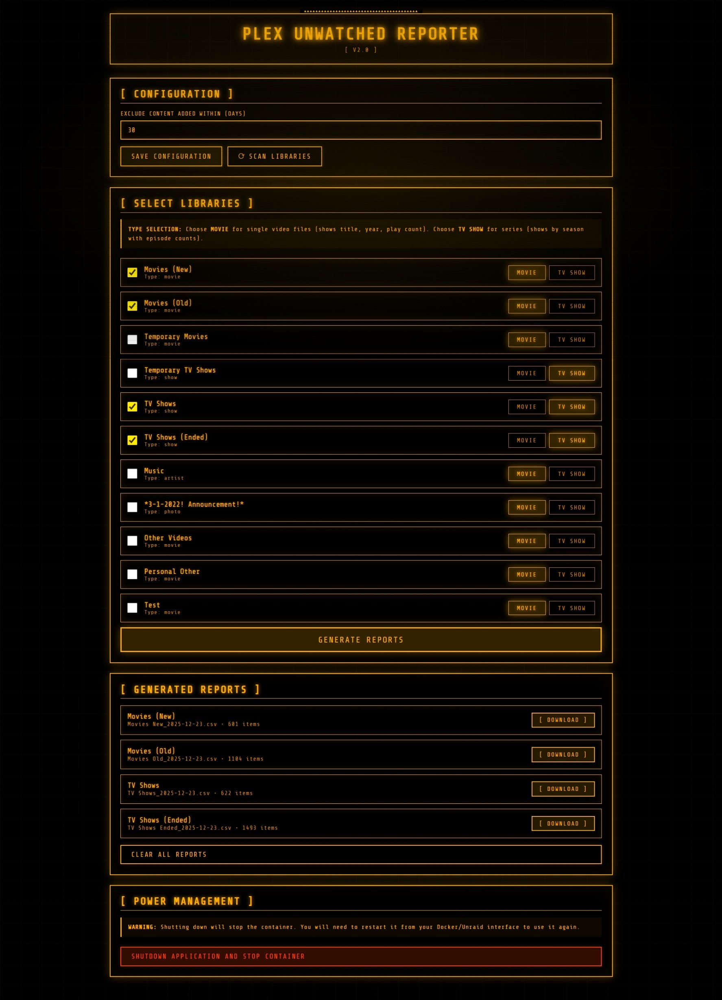

# Plex Unwatched Reporter

<p align="center">
  <em>A retro terminal-style web interface for generating CSV reports of unwatched content from your Plex Media Server.</em>
</p>

## Features

- 🎬 **Movie Libraries**: Detailed reports with title, year, play count, file path, and size
- 📺 **TV Show Libraries**: Season-by-season reporting with episode watch statistics
- 🖥️ **Retro Terminal UI**: Amber CRT-inspired interface with scanlines and glow effects
- 💾 **Persistent Configuration**: Library selections and settings saved between sessions
- ⏱️ **Smart Filtering**: Exclude recently added content (configurable days)
- 📊 **CSV Export**: Easy-to-analyze spreadsheet format
- 🗑️ **Report Management**: Clear old reports with one click

## Screenshots



## Quick Start

### Docker Compose (Recommended)

1. Create a `docker-compose.yml` file:
```yaml
version: '3.8'

services:
  plex-reporter:
    image: thadawilliams/plex-unwatched-reporter:latest
    container_name: plex-unwatched-reporter
    ports:
      - "4080:8089"
    volumes:
      - ./config:/config
      - ./reports:/reports
      # UPDATE THIS PATH to your Plex database location
      - /mnt/user/appdata/plex/Library/Application Support/Plex Media Server/Plug-in Support/Databases:/plex-db:ro
    environment:
      - TZ=America/New_York
    restart: unless-stopped
```

2. Update the Plex database path to match your system
3. Run: `docker-compose up -d`
4. Access at: `http://your-server-ip:4080`

### Docker Run
```bash
docker run -d \
  --name plex-unwatched-reporter \
  -p 4080:8089 \
  -v ./config:/config \
  -v ./reports:/reports \
  -v /path/to/plex/Databases:/plex-db:ro \
  -e TZ=America/New_York \
  thadawilliams/plex-unwatched-reporter:latest
```

### Unraid

1. Open **Community Applications**
2. Search for "Plex Unwatched Reporter"
3. Click **Install**
4. Configure paths:
   - **Config**: `/mnt/user/appdata/plex-unwatched-reporter`
   - **Reports**: `/mnt/user/Downloads` (or your preferred location)
   - **Plex Database**: `/mnt/user/appdata/plex/Library/Application Support/Plex Media Server/Plug-in Support/Databases`
5. Click **Apply**

## Usage

### 1. Configure Settings

- **Plex Database Path**: Default is `/plex-db/com.plexapp.plugins.library.db` (already mapped in Docker)
- **Output Directory**: Where CSV reports are saved (default: `/reports`)
- **Exclusion Period**: Ignore content added within X days (default: 30)
- Click **Save Configuration**

### 2. Scan Libraries

Click **Scan Libraries** to detect all available Plex libraries from your database.

### 3. Select Libraries

- ✅ Check boxes next to libraries you want to report on
- Choose **MOVIE** for single video files (includes title, year, play count)
- Choose **TV SHOW** for episodic content (reports by season with episode counts)

### 4. Generate Reports

Click **Generate Reports** to create CSV files. Progress is shown in real-time. Download links appear when complete.

### 5. Manage Reports

Use **Clear All Reports** button to delete all generated CSV files when you're done with them.

## Volume Mounts

| Container Path | Purpose | Example Host Path |
|---------------|---------|-------------------|
| `/config` | Persistent configuration | `./config` or `/mnt/user/appdata/plex-unwatched-reporter` |
| `/reports` | Generated CSV files | `./reports` or `/mnt/user/Downloads` |
| `/plex-db` | Plex database (read-only) | `/mnt/user/appdata/plex/.../Databases` |

## Common Plex Database Paths

- **Unraid**: `/mnt/user/appdata/plex/Library/Application Support/Plex Media Server/Plug-in Support/Databases`
- **Linux**: `/var/lib/plexmediaserver/Library/Application Support/Plex Media Server/Plug-in Support/Databases`
- **Windows**: `C:\Users\[USER]\AppData\Local\Plex Media Server\Plug-in Support\Databases`
- **macOS**: `~/Library/Application Support/Plex Media Server/Plug-in Support/Databases`

## Report Formats

### Movie Reports Include:
- Title
- Year
- Date Added to Plex
- Play Count
- File Path
- File Size

### TV Show Reports Include:
- Show Title
- Season Number
- Watched Status (Yes/No - based on any episode watched)
- Total Episodes in Season
- Episodes Watched Count
- Date Added to Plex

## Environment Variables

| Variable | Default | Description |
|----------|---------|-------------|
| `TZ` | `UTC` | Timezone for date/time display |

## Troubleshooting

### Database Not Found

**Error**: "Database file not found"

**Solution**: 
- Verify Plex database path in docker-compose.yml is correct
- Ensure path exists: `ls -la "/path/to/plex/Databases/"`
- Check volume mount is configured as read-only (`:ro`)
- Make sure Plex is installed and has been run at least once

### Port Already in Use

**Error**: Port 4080 conflict

**Solution**: Change the host port (first number) in docker-compose.yml:
```yaml
ports:
  - "8090:8089"  # Changed to 8090
```
Then access via `http://your-ip:8090`

### Reports Not Generating

**Symptoms**: No errors but reports don't appear

**Solution**:
- Check Docker logs: `docker logs plex-unwatched-reporter`
- Verify at least one library is selected
- Ensure reports directory has write permissions
- Check that selected libraries actually exist in Plex

### No Libraries Showing

**Symptoms**: Scan Libraries returns empty or shows error

**Solution**:
- Verify Plex database path is correct
- Ensure database file is accessible (check permissions)
- Try stopping Plex temporarily if database is locked
- Check Docker logs for specific error messages

## Building from Source
```bash
git clone https://github.com/thadawilliams/plex-unwatched-reporter.git
cd plex-unwatched-reporter
docker build -t plex-unwatched-reporter .
docker-compose up -d
```

## Contributing

Contributions welcome! Please:

1. Fork the repository
2. Create a feature branch (`git checkout -b feature/amazing-feature`)
3. Commit your changes (`git commit -m 'Add amazing feature'`)
4. Push to the branch (`git push origin feature/amazing-feature`)
5. Open a Pull Request

## License

This project is licensed under the GNU Affero General Public License v3.0 - see the [LICENSE](LICENSE) file for details.

This means:
- ✅ You can use, modify, and distribute this software
- ✅ You can use it commercially
- ⚠️ You must disclose source code of any modifications
- ⚠️ You must license derivative works under AGPL-3.0
- ⚠️ Network use counts as distribution (must share modifications)

## Support

- 🐛 [Report Issues](https://github.com/thadawilliams/plex-unwatched-reporter/issues)
- 💡 [Request Features](https://github.com/thadawilliams/plex-unwatched-reporter/issues/new)
- 📖 [Documentation](https://github.com/thadawilliams/plex-unwatched-reporter/wiki)

## Acknowledgments

- Built with [Flask](https://flask.palletsprojects.com/) and Python
- Inspired by retro computing and CRT terminal aesthetics
- Special thanks to the Plex community

---

**Made with ❤️ for all beings in the universe.**
